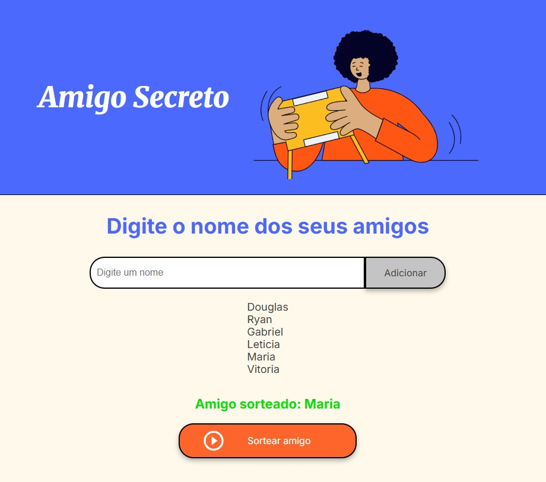

# Challenge - Amigo Secreto 🎁

Este é um simples jogo de Amigo Secreto desenvolvido em JavaScript, HTML e CSS. O objetivo do jogo é permitir que os usuários adicionem nomes de amigos a uma lista e, em seguida, sorteiem aleatoriamente um nome da lista para determinar quem será o amigo secreto. 

## Funcionalidades

- **Adicionar nomes**: Os usuários podem escrever o nome de um amigo em um campo de texto e adicioná-lo a uma lista visível ao clicar no botão "Adicionar" ou pressionando a tecla "Enter".
- **Validar entrada**: Se o campo de texto estiver vazio, o programa exibirá um alerta solicitando um nome válido.
- **Visualizar a lista**: Os nomes inseridos aparecerão em uma lista abaixo do campo de entrada.
- **Sorteio aleatório**: Ao clicar no botão "Sortear Amigo", um nome da lista será selecionado aleatoriamente e exibido na página.

## Estrutura do Projeto

### HTML

O arquivo `index.html` contém a estrutura básica do jogo, incluindo os elementos de entrada, botões e listas para exibir os nomes e o resultado do sorteio.

### CSS

O arquivo `style.css` é utilizado para estilizar a página, tornando-a visualmente agradável.

### JavaScript

O arquivo `app.js` contém a lógica do jogo, incluindo as funções para adicionar nomes, validar entradas, atualizar a lista de nomes e sortear um nome aleatoriamente.

## Como Usar

1. Abra o arquivo `index.html` em um navegador web.
2. Digite o nome de um amigo no campo de texto.
3. Clique no botão "Adicionar" ou pressione a tecla "Enter" para adicionar o nome à lista.
4. Repita os passos 2 e 3 para adicionar mais nomes.
5. Clique no botão "Sortear Amigo" para sortear um nome aleatoriamente da lista.